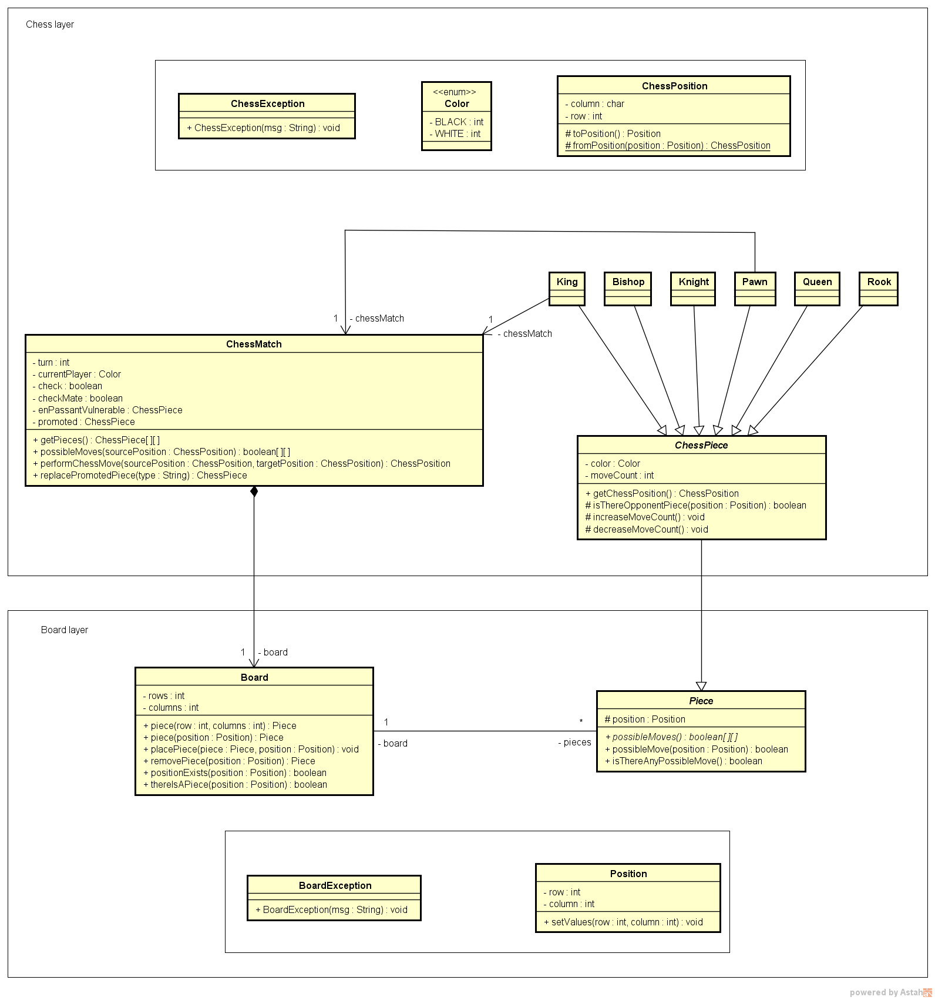

# :trophy: Chess System Java


## 🚀 technologies 

This project was developed with the following technologies:

- Java

## 💻 Project

This application consists of a simple chess game that can be run through the terminal. The game has error handling, defensive programming (against bugs), special chess moves (promotion, castling and en passant) and prediction of the movement of pieces.


  
Peaces: ♙ Pawn, ♖ Rook, ♘ Knight, ♗ Bishop, ♕ Queen and ♔ King.
|-|

* The game mechanics are based on **rows** (_1, 2, 3, 4, 5, 6, 7, 8_) and **columns** (_a, b, c, d, e, f, g, H_):
  * To **choose** a piece it is necessary to _first_ select the **column** and then (without spaces) select the **row**, example: **c2**
  * In **Captured pieces** the game stores the captured pieces.
  * The **Turn** displays the turn (round) the game is on.
  * **Waiting player** displays which player plays the next piece.
  * **Source** is the origin, that is, the piece on which the player will play.
  * **Target** is the target, that is, the place where the player will move the piece.
  * The game has **Check** and **CheckMate** system
  
## ♟️ Installation

1. Download and extract the project.
2. Open a terminal with color support. Example: Windows Terminal, git bash, etc...
3. Enter the project's /bin directory
4. After entering the directory, type ```Java application.Program``` to run the application (Java must be at version 11 or higher).
5. Good Game!

## 🖼️ Images

### ✍️ Conceptual Model



## 📝 License

[MIT License](https://github.com/Alexandresl/Chess-System-Java/blob/main/LICENSE) © [Alexandre Lima](http://alexandrelima.dev/)
